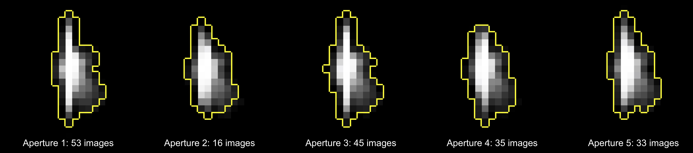

# `kmao`
## *k*-Means Aperture Optimization for Kepler K2 data
---

---

k-Means Aperture Optization (`kmao`) is a technique for correcting aperture photometry in the presence of target motion, saturation, and/or strongly varying backgrounds.

`kmao` optimizes a small *set* of apertures. These apertures each apply to a unique sub-set of the target images that have similar properties. The assigment of images to these sets is done via [*k*-means clustering](https://en.wikipedia.org/wiki/K-means_clustering) on the target pixel files.

The advantage of this approach is that it requires no external information to correct photometry of a source. As such, the photometry of a uniquely moving, saturated source can be corrected using `kmao` as easily as a stationary, un-saturated source. For more details, see [our preprint](http://www.alexharrisonparker.com/s/Parker2019_PASP.pdf).

This repository currently contains preliminary scripts demonstrating this technique in support of [Parker et al. (submitted, PASP)](http://www.alexharrisonparker.com/s/Parker2019_PASP.pdf). Future updates will expand the example cases and built out further `kmao` pipeline functionality.

## Requirements

For the kmao algorithm:
* numpy
* scipy
* sklearn

Additional requirements to run the example scripts:
* [lightkurve](https://docs.lightkurve.org/index.html)
* matplotlib

## Running the example scripts

Running `python src/example1.py` will download the *Kepler K2* target pixel files for EPIC 202063160, a saturated campaign 0 eclipsing binary star, and perform a single-aperture and 30-aperture optimziation on them, displaying the result. You may compare these results to the [EVEREST 2.0 results in Figure 1 of Luger et al. 2018](https://iopscience.iop.org/article/10.3847/1538-3881/aad230/meta).

## Citation

If your work uses the utilities provided in this repository, please cite:

Parker, A. Hörst, S., Ryan, E., & Howett, C. (PASP, submitted). "k-Means Aperture Optimization Applied to Kepler K2 Time Series Photometry of Titan."

## Referencecs

* Luger, R., Kruse, E., Foreman-Mackey, D., Agol, E., & Saunders, N. "An Update to the EVEREST K2 Pipeline: Short Cadence, Saturated Stars, and Kepler-like Photometry Down to Kp = 15" AJ 156, 99-120.
* Parker, A. Hörst, S., Ryan, E., & Howett, C. (PASP, submitted). "k-Means Aperture Optimization Applied to Kepler K2 Time Series Photometry of Titan."

